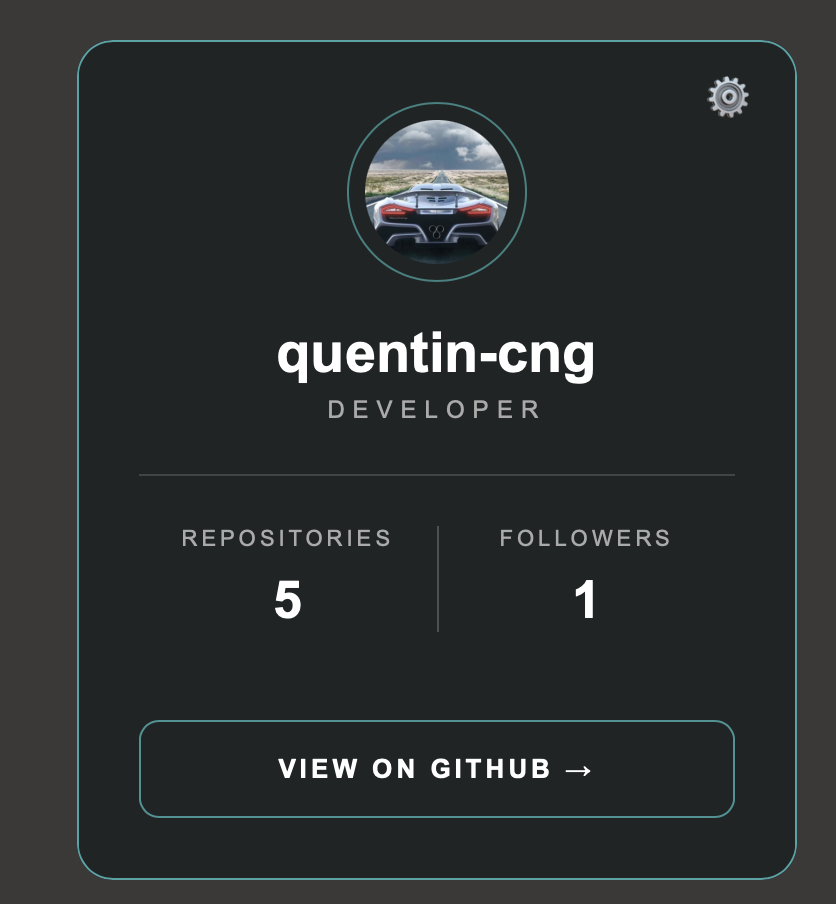
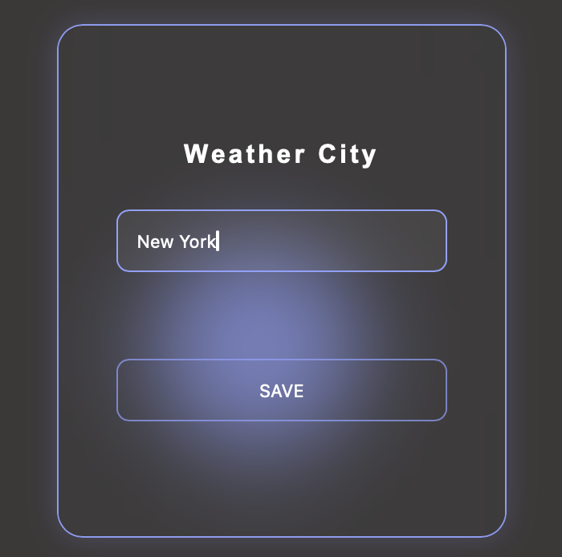
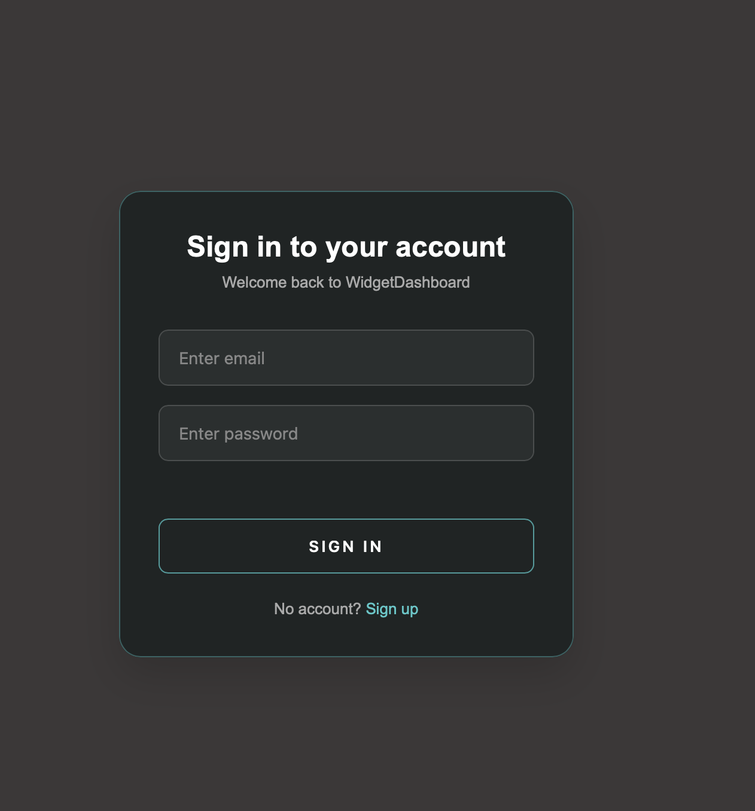
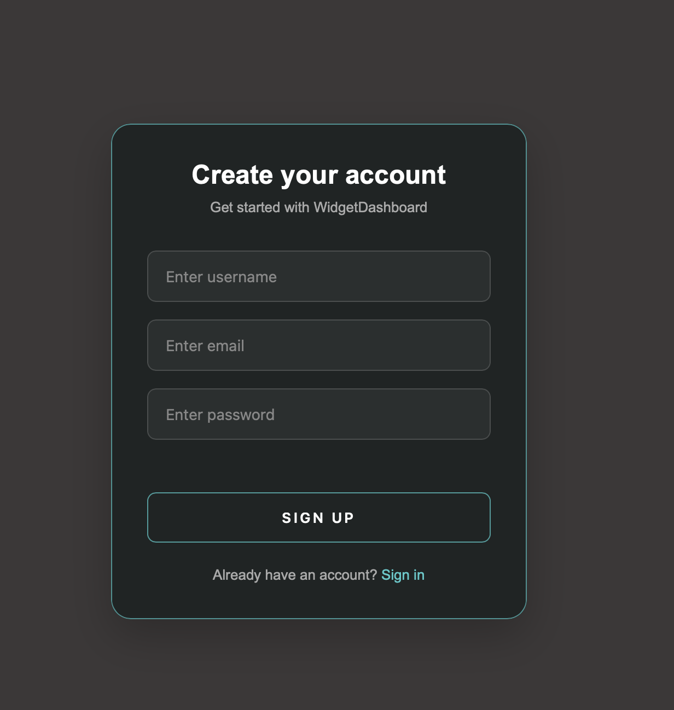

# WidgetDashboard

A customizable personnal dashboard built with FastAPI, PostgreSQL and JavaScript.

Live Demo : https://widgetdashboard.onrender.com/login

This project allows users to create an account and manage a personalized dashboard made of configurable widgets. User preferences are stored in POstgreSQL.

The project, as of now, includes:
- A weather widgets connected to the Open-Meteo API
- A Github profile widget connect to the Github API
- User authentification with JWT


## Features

- User signup and login
- Secure password hashing with Argon2
- JWT-based authentication
- Personalized dashboard for each user
- Persistent widget preferences
- Weather data for a configurable city
- GitHub profile statistics and recent repositories
- Responsive interface for desktop and mobile
- Error and loading state handling
- REST API built with FastAPI

## Tech Stack

### Backend
- Python
- FastAPI
- SQLAlchemy
- Alembic
- PostgreSQL
- Pydantic
- JWT authentication
- Argon2 password hashing

### Frontend
- HTML
- CSS
- Javascript
- Jinja2

### External APIs
- Open-Meteo API
- Github API

### Deployment
- Render - FastAPI web service
- Neon - PostgreSQL database


## Screenshots

### Dashboard Widgets

#### Github Widget


#### Weather Settings


### Authentification

#### Login


#### Sign up



## Architecture 
Simple client-server architecture :

```text
Browser
   │
   │ HTML / CSS / JavaScript
   ▼
FastAPI Backend (Render)
   │
   ├── Authentication & JWT
   ├── User preferences
   ├── Weather service ──────► Open-Mete API
   └── GitHub service ───────► GitHub API
   │
   ▼
SQLAlchemy
   │
   ▼
PostgreSQL (Neon)

```

## Project structure

WidgetDashboard/
├── alembic/
│   ├── versions/
│   │   ├── 9bab6a71d331_add_password_hash_to_users.py
│   │   ├── b0c59a8f9070_add_unique_user_widget_constraint.py
│   │   ├── c25d31523998_create_users_table.py
│   │   └── da6c39420cae_create_widget_preferences_table.py
│   ├── env.py
│   ├── README
│   └── script.py.mako
├── app/
│   ├── routers/
│   │   ├── widgets/
│   │   ├── __init__.py
│   │   ├── auth.py
│   │   ├── dashboard.py
│   │   └── users.py
│   ├── __init__.py
│   ├── auth.py
│   ├── database.py
│   ├── main.py
│   ├── models.py
│   └── schemas.py
├── docs/
│   ├── github.png
│   ├── login.png
│   ├── signup.png
│   └── weatherSettings.png
├── static/
│   ├── css/
│   │   ├── auth.css
│   │   └── style.css
│   └── js/
│       ├── dashboard.js
│       ├── login.js
│       └── signup.js
├── templates/
│   ├── dashboard.html
│   ├── login.html
│   └── signup.html
├── .env
├── .gitignore
├── alembic.ini
├── compose.yaml
├── README.md
└── requirements.txt

## Running Locally

### 1. Clone

```bash
git clone https://github.com/quentin200/WidgetDashboard.git
cd WidgetDashboard
```

### 2. Create virtual env
```bash
python -m venv .venv
source .venv/bin/activate
```

On Windows:
```bash
.venv\Scripts\activate
```

### 3. Install dependencies
```bash
pip install -r requirements.txt
```

### 4. Configure environment variables
Create a `.env` file at the root of the project:

```env
DATABASE_URL=your_postgresql_connection_string
SECRET_KEY=your_secret_key
```

A secure secret key can be generated with:
```bash
python -c "import secrets; print(secrets.token_hex(32))"
```

### 5. Apply database migrations

```bash
alembic upgrade head
```

### 6. Start the app

```bash
python -m fastapi dev app/main.py
```

Then open:
`http://127.0.0.1:8000`


## Database

The database currently stores:
- user accounts
- Securely hashed passwords
- Widget preferences
- Widget configuration per user

# Deployment

The app is deployed using : 
- **Render** - FastAPI web service
- **Neon** - PostgreSQL database